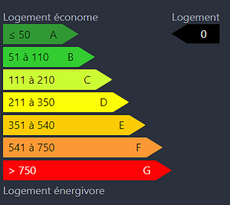

# Nuxt Component DPE

## How to use :

1. Install package
```
npm install nuxt-component-dpe
```
2. Init component in Nuxt with values
```
<dpe valueDPE="0" :style="'width:25%;'"/>
```
3. Result



## Compatibility :


