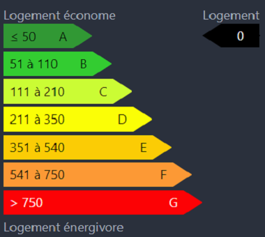

# Nuxt Component DPE


## How to use :

### 1. Install package

```js
npm install nuxt-component-dpe
```

### 2. Import package

```js
import dpe from 'nuxt-component-dpe';
```

```js
export default {
  components: {dpe}
}
```

### 3. Init component in Nuxt with values

- With Export Mode (PNG):
```js
<dpe valueDPE="0" :style="'width:25%;'" exportMode="active"/>
```

- Without Export Mode (PNG):
```js
<dpe valueDPE="0" :style="'width:25%;'"/>
```

### 4. Result

With Export Mode (PNG)           |  Without Export Mode (PNG)
:-------------------------:|:-------------------------:
  |  


### 5. Compatibility 


