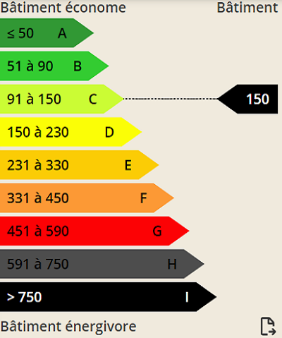
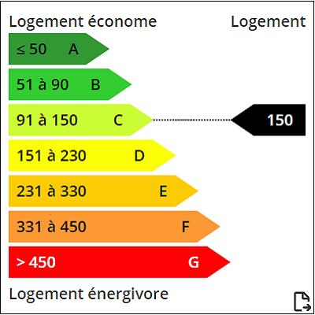
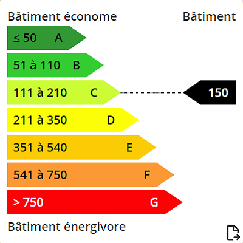

# Nuxt Component DPE

## How to use :

### 1. Install package

```js
npm install nuxt-component-dpe
```

### 2. Import package

```js
import { dpe, ges } from 'nuxt-component-dpe';
```

```js
export default {
  components: { dpe, ges }
}
```

### 3. Init component in Nuxt with values

- With Export Mode (PNG):
```js
<dpe value=100 type="logement" :style="'width:25%;'" exportMode="active"/>
```

```js
<ges value=20 type="logement" :style="'width:25%;'" exportMode="active"/>
```

- Without Export Mode (PNG):
```js
<dpe value=100 type="logement" :style="'width:25%;'"/>
```

```js
<dpe value=20 type="logement" :style="'width:25%;'"/>
```

With Export Mode (PNG)           |  Without Export Mode (PNG)
:-------------------------:|:-------------------------:
  |  
With Custom CSS         |  Without Custom CSS
  |  

### 4. Parameters type :

```js
<dpe value=150 type="logement" :style="'width:25%;background: white;border: 1px solid;padding: 8px;'" exportMode="active"/>
````

```js
Valeurs possibles :
1. logement
2. tertiaire
3. public
4. bureaux
5. OccContinue
```

DPE          |  GES
:-------------------------:|:-------------------------:
logement|logement
  |  
tertiaire|tertiaire
  |  
public|public
  |  
bureaux|bureaux
  |  
OccContinue|OccContinue
  |  

### 5. Compatibility 


